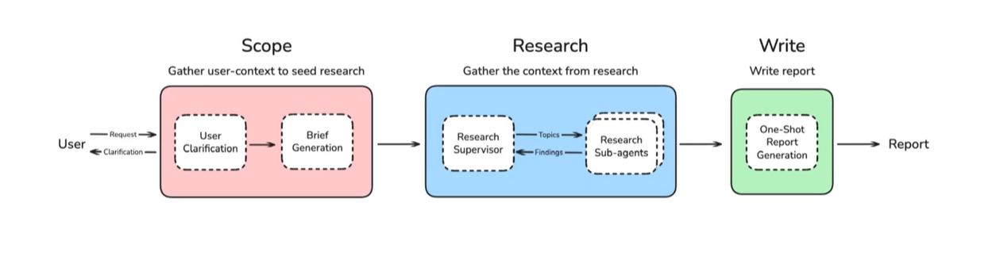
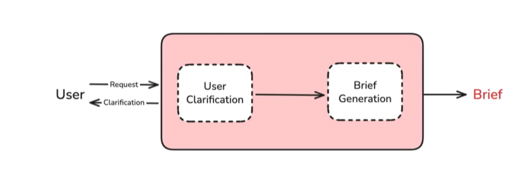
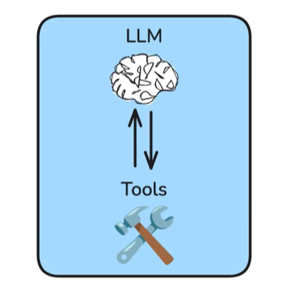
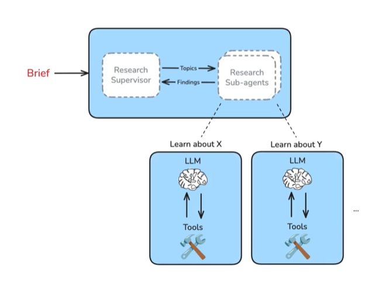

# deep research with langgraph

deep research follows 3 phases:

- scope
- research
- writing

Full System

- 

Scoping

coverse with user ( can be back and forth ) -> gather context -> research breif ( to ground and steer the research process)

- 

Research

- 
- 
